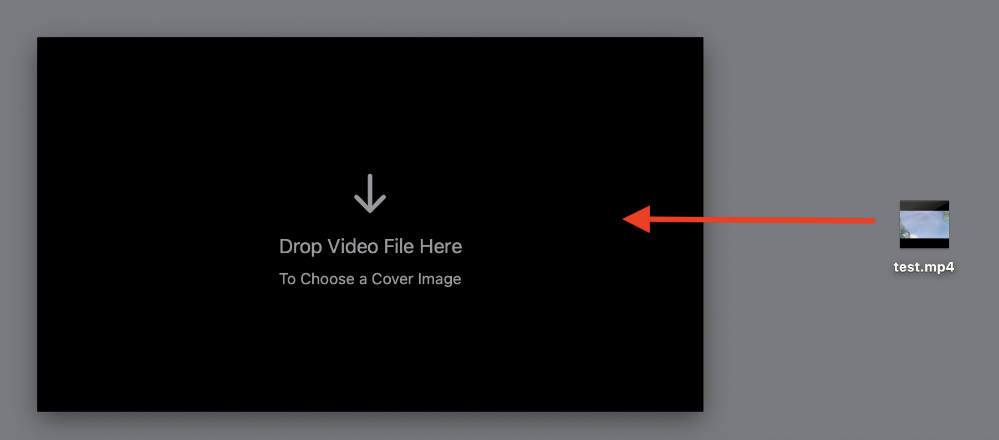
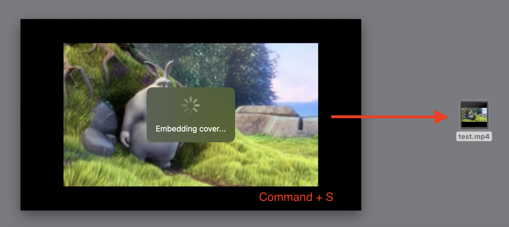

# Coversetter

Coversetter is a macOS app for setting cover images on video files. Drop a video, seek to a frame, and save it as the cover with a single command (⌘S). Built with SwiftUI, it uses FFmpeg for cover embedding and offers a simple, drag-and-drop interface.

## Features
- Drag-and-drop video files (`.mp4`, `.mov`, `.hevc`).
- Preview and seek videos to select a cover frame.
- Save the current frame as the video’s cover using FFmpeg.
- Minimal UI with a progress spinner during processing.

## Requirements
- macOS 15.0+
- FFmpeg installed (`/opt/homebrew/bin/ffmpeg`)
